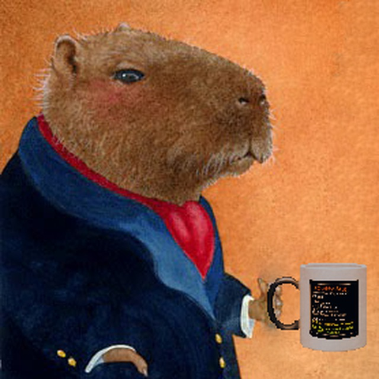

# 👋 Welcome to my GitHub!

My name is **Andrei Klinchev**, glad to see you in my remote repository!

## 👨‍🎓 A little about me

I am a 2nd-year student at **MSU (Moldova State University)**, Faculty of *Informatics and Mathematics*, majoring in *Applied Informatics*.  
I enjoy exploring and learning new and complex things, coming up with algorithms to solve various problems and optimize solutions.  
I am constantly learning, trying to overcome procrastination, and improving my skills.

## 🔍 Areas of interest

- Game development  
- Algorithms and data structures  
- Prompt engineering  

## 💻 Programming languages

### 📌 I know

- Python  
- JavaScript  
- C++  
- Pascal ABC 😄  

### 📚 Currently learning

- Java (Spring)  
- C#  
- PostgreSQL  

### 📝 Planning to learn

- Oracle  
- Go  

## 📬 How to reach me

- Email: klinchevstudy@gmail.com  
- Telegram: [@Coffevarca](https://t.me/Coffevarca)  
- GitHub: [github.com/AndreiKlinchev](https://github.com/AndreiKlinchev)
